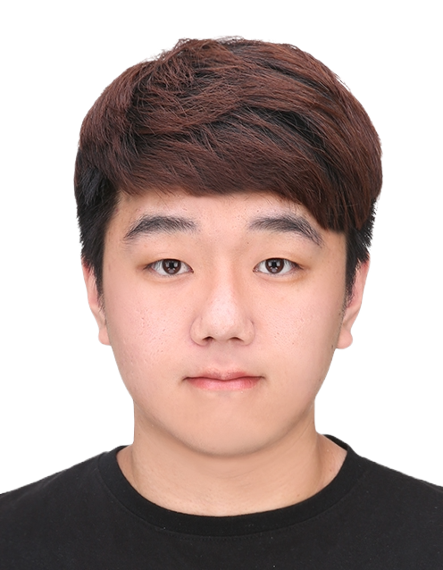

# Taewook Kang | Senior Flutter Developer Portfolio

<p align="center">
  
</p>

<p align="center">
  <a href="https://github.com/woogi-kang" target="_blank">
    
  </a>
  <a href="https://www.linkedin.com/in/taewook-kang/" target="_blank">
    
  </a>
  <a href="https://medium.com/@dev-woogi" target="_blank">
    
  </a>
</p>

## About Me

Senior Flutter Developer with 5+ years of experience building high-performance, enterprise-grade mobile applications. Specializing in clean architecture, performance optimization, and scalable solutions that serve millions of users.

## Portfolio Highlights

- **Professional Experience**: Detailed work history showcasing enterprise mobile application development
- **Technical Projects**: Case studies of significant projects with architecture details and technical challenges
- **Skills & Expertise**: Comprehensive overview of technical skills and proficiencies
- **Blog & Insights**: Technical articles and development insights

## Tech Stack

- **Mobile**: Flutter, Dart, iOS (Swift), Android (Kotlin)
- **Web**: Next.js, React, TypeScript, TailwindCSS
- **Backend**: Node.js, NestJS, Firebase, Supabase
- **Architecture**: Clean Architecture, MVVM, BLoC Pattern
- **DevOps**: CI/CD, Docker, GitHub Actions

## Getting Started

This portfolio is built with Next.js, TailwindCSS, and Supabase.

```bash
Clone the repository
git clone https://github.com/woogi-kang/portfolio.git
Install dependencies
npm install
or
yarn install
Run the development server
npm run dev
or
yarn dev
```

Open [http://localhost:3000](http://localhost:3000) to view the portfolio locally.

## Contact

I'm always open to discussing new opportunities or connecting with fellow developers. Feel free to reach out via:

- Email: woogi.dev@gmail.com
- LinkedIn: [taewook-kang](https://www.linkedin.com/in/taewook-kang/)
- GitHub: [woogi-kang](https://github.com/woogi-kang)

## License

© 2024 Taewook Kang. All rights reserved.
